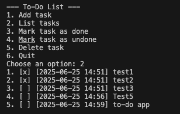

# Lua CLI To-Do List

## Functions:
- Adding a task with a timestamp
- Listing all tasks
- Marking tasks as done or undone
- Deleting tasks

`todo.txt` is updated automatically after every action.

## Example of usage:



```bash
lua main.lua